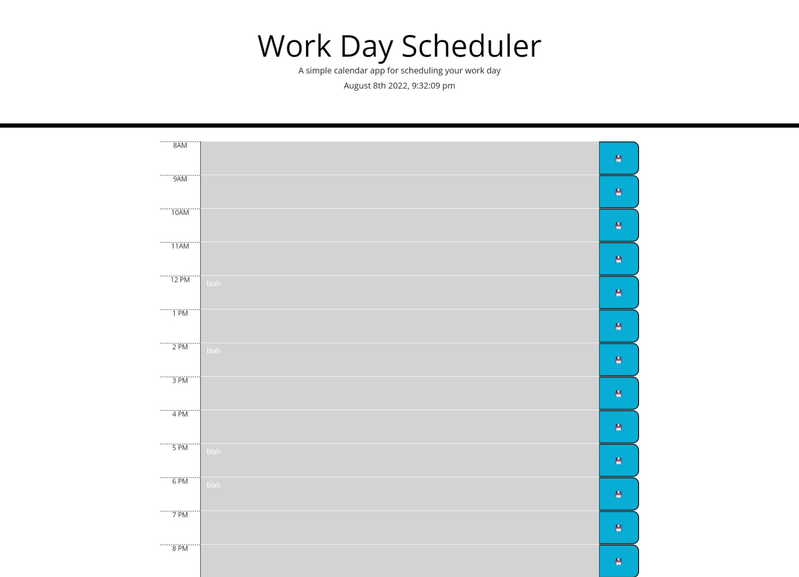

# CalendarApplication

# Description of Project
The purpose of this project was to create an interactive calendar application using JQuery, HTML, and CSS. All of the elements on the page were added dynamically through JQuery.

## Functionality
[HTML]
* Added an id of "planner" to the div container in order to call that id in JQuery and append elements to it.

[CSS]
* Added the existing CSS properties in dynamically through JQuery

[JQuery]
* used `moment()` to create the exact date/time at the top of the page
* added the id "planner" to the div container that contains all of the elements
* set a variable for the current hour in order to apply the CSS styling later
* created two arrays for the actual hour times. Had to toggle it a little bit because it wasn't reading just one
* `displayAgenda()` is the function where all of the HTML elements are dynamically created
* created a for loop to display an appropriate 12 hour schedule 
* used `.addClass` to add in all of the CSS properties given at the beginning of the assignment
* also used `col-` from the Bootstrap grid to toggle the sizing of the elements without changing the CSS
* used an if/else statement with the values from the "work hours" array to create the AM/PM values
* found the floppy disk emoji online and used it for the save button 
* set attributes for the save button and textareas to individualize them so input wouldn't populate on all of the open fields
* used a click event to save any input to local storage
* specifically targeted the save button and used it to select its sibling element which is the textarea
* specified that the data number be a part of the key to the local storage
* appended all of the elements to the div container using the append method
* used if/ else if statements in order to change the color of the text boxes to show present/past/future
* Called the `displayAgenda` function to get all of the content to display
* Used the `ready()` to help display the contents of local storage on the page and to keep them displayed even if contents of the textarea are deleted
* used a for loop to loop through each time block and see if anything was put inside of it
* used the find function to scan the document and look for the specific identifier placed on the description element
* console logged everything during troubleshooting and to help me better understand the code

## Assets

[LinktoRepository](https://github.com/Clatimer97/CalendarApplication)
[LinktoLiveApp](https://clatimer97.github.io/CalendarApplication/)

## Author
[@CallanLatimer](https://github.com/Clatimer97)